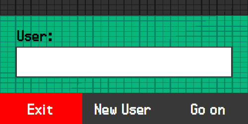
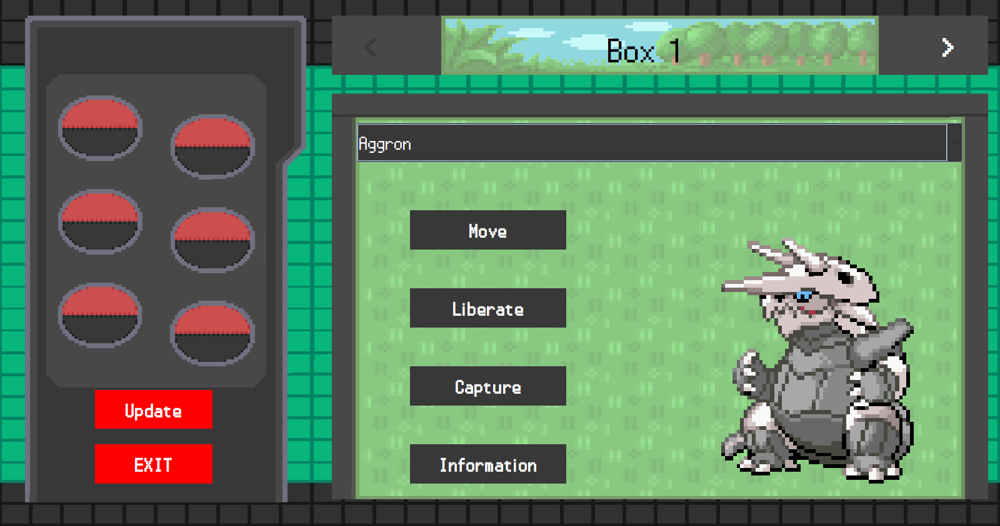
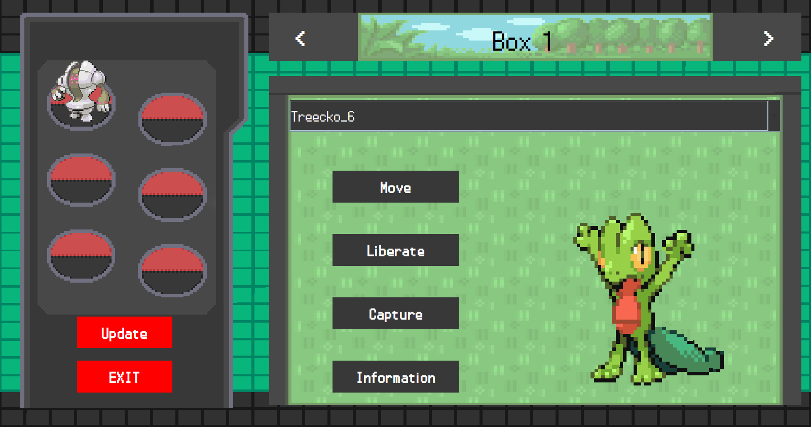
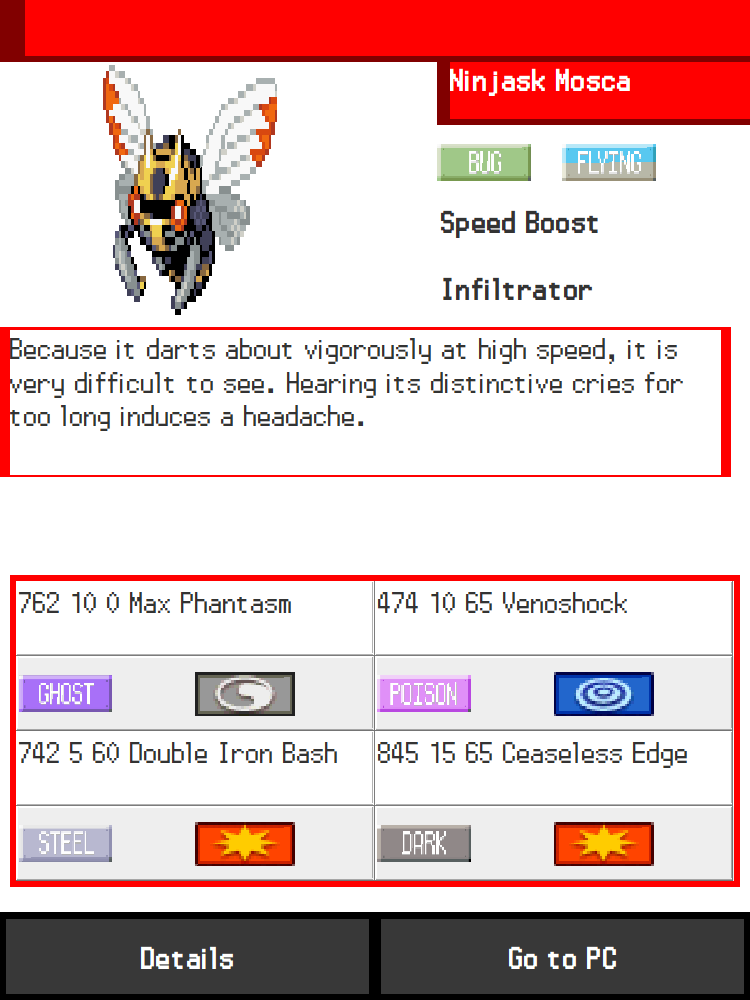
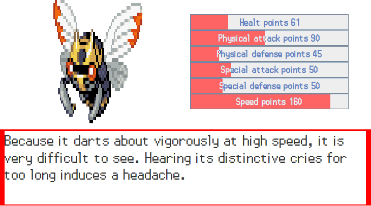

# Pokemon Client
Pokemon Client is a program made to work in conjunction with your server.

In this you can perform various actions such as creating custom pokemon, with the ability to get into boxes of infinite sizes in addition to having at hand to 6 pokemon.

## Functionalities:
- Create third generation pokemon with nicknames.
- Display pokemon with animated sprites.
- Release, move and view pokemon stats.

## Galery:

